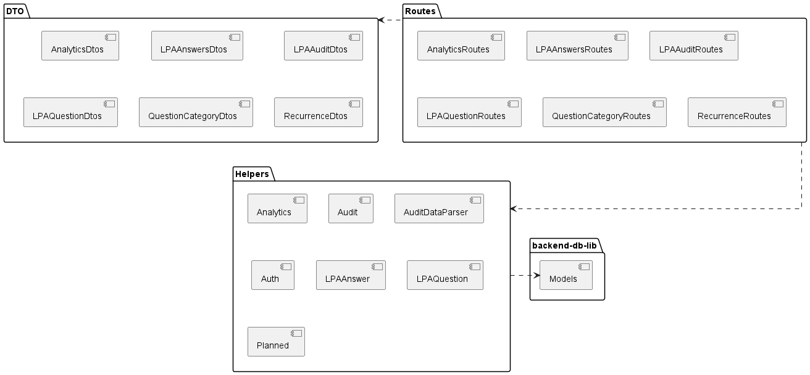
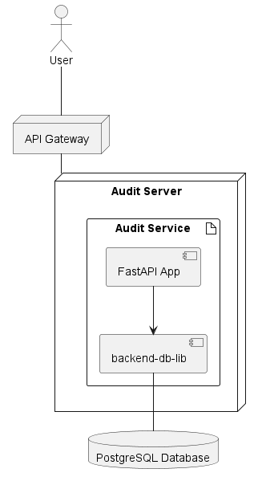
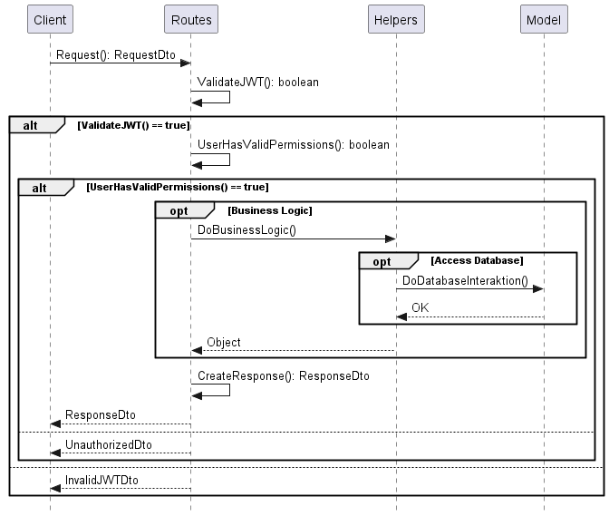

# LPA Audit Service

This repository contains the code of Audit Service, which handles everything related to LPA Audits. For further information refer to the [wiki](https://github.com/Projekt-DataScience/backend-audit/wiki).

# Architecture

## Packages



## Deployment



## Requests

The following UML sequence diagram describes how a request is processed by the audit service:



# Getting Started

This chapter describes how you can get started developping.

## Structure

The backend-audit service is implemented in FastAPI. The code can be found under `/app`. That directory also contains the Dockerfile to build a docker image of the service. For convenience, you can also you docker-compose, but the docker-compose file is located in the root of the repository. The base Docker image used, is a Python 3.10 Debian image.

The root directory of repository contains the docker-compose.yml file, which can be used to start the service in a docker container. It also starts dependencies, such as a database server and pgAdmin for a frontend to the database server.

## Getting started as a Developer

1. Clone the repository

```
git clone https://github.com/Projekt-DataScience/backend-audit.git
```

2. Change your working directory to backend-audit

```
cd backend-audit
```

3. Create a virtualenv

```
https://github.com/Projekt-DataScience/backend-audit.git
```


4. Activate the virtualenv

```
source venv/bin/activate
```

5. Now install the dependencies

```
pip install -r app/requirements.txt
```

6. After the dependencies are successfully installed, you can now configure the environment file for the docker containers. For that copy the `example.env` to `.env`

```
cp example.env .env
```


7. OPTIONAL: Open the `.env` file in a editor. You can change everything except for DB_HOSTNAME

8. Now you can start the docker container with the following command:

```
docker-compose up
```

This command will start the database server, after that it will start pgAdmin and the Audit service. The audit service will run on port 8000. The pgAdmin service will run on port 8080. And the database server will run on the port, that you have specified in the `DB_PORT` environment variable in the .env file

If you see this, then the Audit service is started:


That also means, that the database server started successfully. If you see this, then pgAdmin is started:


9. Now we have to create the database and add some data. This is only for a dev environment. For that purpose you can use the create_data.py script inside the helper_scripts directory. Run the following command from the root path of this repository.

```
python helper_scripts/create_data.py
```

After the script has finished, it has created some users, layers, groups, questions, question categories, answer reasons and 5 audits.


10. Next navigate to http://localhost:8080


11. You can log into pgAdmin with the username you have specified for `PGADMIN_EMAIL` environment variable and with the password in `PGADMIN_PASSWORD` variable. (both in .env file). After the successfull login you shoudl see the following page:


12. Next right click on "Servers". Choose "Register" > "Server..."


13. Specify a Name


14. Specify the Connection details.

- Hostname should be "db"
- Port should be the Port you have specified in the .env file for `DB_PORT`
- Maintenance database should be the database name you have specified in the .env file for `DB_NAME`
- Username should be the value, which you have specified in the .env file for `DB_USER`
- Password should be the value, which you have specified in the .env file for `DB_PASSWORD`


Finally click the "Save" Button.

15. OPTIONAL: If you expand "Backend" > "Databases" > "backend" > "Schemas" > "public" > "Tables", you should see the db tables


16. Now you can start developing with your preferred IDE. If you navigate to http://localhost:8000/api/audit/docs, you can see a Swagger UI of Audit Service.


